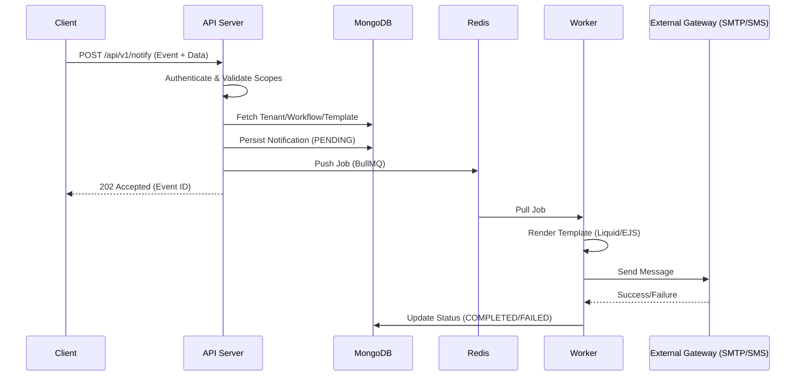

# System Architecture

This document describes the high-level architecture and data flow of the Notification Service.

## 🏗️ Technical Overview

The Notification Service is designed as a distributed system to ensure reliability and scalability. It separates the ingestion of events from the actual processing and delivery.

### Core Components

1.  **API Server (Express)**: Handles incoming webhooks, admin UI requests, and tenant management.
2.  **Job Queue (BullMQ/Redis)**: Acts as a buffer between event ingestion and delivery.
3.  **Worker Process**: Consumes jobs from Redis, processes workflows, renders templates, and interfaces with delivery gateways (SMTP, SMS providers).
4.  **Database (MongoDB)**: Stores tenant configuration, workflows, templates, and notification logs.

## 🔄 Data Flow

### Event Ingestion to Delivery

## 🔐 Security Architecture

- **API Keys**: Hashed (SHA-256) storage. Keys are associated with specific scopes and allowed IPs.
- **IP Allowlisting**: Multi-layered IP filtering (Global, Tenant, or API Key level).
- **Rate Limiting**: Per-tenant rate limiting enforced via Redis.
- **Origin Validation**: CORS enforcement for browser-based tracking pixels.

## 📂 Database Schema

- **Tenants**: Organizations using the service.
- **Workflows**: Logic mapping events to templates and integrations.
- **Templates**: Reusable layouts for different channels.
- **Integrations**: Gateway credentials (SMTP, Twilio, etc.).
- **Notifications**: Audit log and status tracking for every event ingested.
